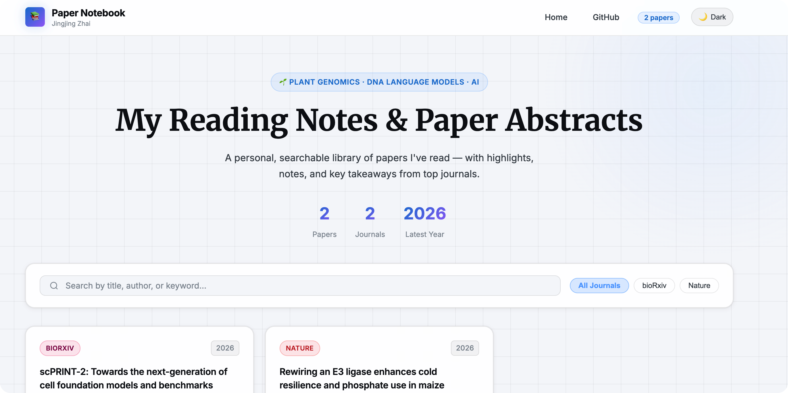

# AI-Curated Paper Notebook

A personal, agent-driven academic website for collecting, summarizing, and displaying research papers. 

This repository contains both a **static frontend website** to beautifully showcase your reading list, and a suite of **Agentic Skills** that use Model Context Protocol (MCP) to autonomously discover, summarize, and link new papers.

 *(Note: You can add a screenshot here later)*

## ✨ Features

- **Static Frontend**: Fast, lightweight HTML/CSS/JS site.
- **Dynamic Filtering**: Sort papers by journal, tags, or search across authors and abstracts.
- **Deep Integrations**:
  - 🤖 **Automated Research**: Uses Firecrawl to monitor specific journals (Nature, Cell, PNAS, etc.) and generate personalized summaries.
  - 📓 **NotebookLM Linking**: Attach your deep-dive reading notes from Google's NotebookLM directly to the paper cards.
- **Agentic Engine**: The repository provides predefined "Skills" (prompts + scripts) designed for an MCP-enabled AI assistant to run.

---

## 🚀 Getting Started

To set up your own customized paper notebook:

### 1. Fork this Repository
Click the **Fork** button at the top right of this repository to create your own copy on your GitHub account.

### 2. Configure Your Website
1. Open `docs/index.html` and update the `<title>` and header to reflect your name.
2. Open `docs/js/app.js` and edit the `getBasePath()` function if your repository name is different from `paper-notebook`. 
3. *Optional:* Adjust the themes, colors, or CSS in `docs/css/` to your liking.

### 3. Deploy to GitHub Pages
1. Go to your repository's **Settings** > **Pages**.
2. Under "Build and deployment", select **Deploy from a branch**.
3. Select the `main` branch and choose the `/docs` folder as the source.
4. Click **Save**. Your site will be live at `https://<your-username>.github.io/<repo-name>/` in a few minutes!

---

## 🤖 Configuring Automated Research Skills

The real power of this notebook is the AI automation. The `.agents/skills/` directory contains workflows that instruct your AI assistant on how to find and summarize papers.

### Step 1: Install Required MCP Servers
To run the skills, your AI assistant must be connected to the following MCP servers:
1. **[Firecrawl MCP](https://github.com/mendableai/firecrawl)**: Used for searching the web and scraping abstracts/journal tables of contents. You will need a free Firecrawl API key.
2. **[NotebookLM MCP](https://github.com/GoogleCloudPlatform/mcp-notebooklm)**: Used to fetch your personal notes and link them to papers.

### Step 2: Tailor the AI's Research Interests
By default, the skills are configured to look for papers related to *"plant genomics, DNA language models, and AI"*. You should change this to match your field!

1. Open the folders inside `.agents/skills/`.
2. Edit the `SKILL.md` file in each folder (e.g., `cell_researcher/SKILL.md`).
3. Find the prompt section where it describes the research interest, and replace it with your own topics (e.g., *"quantum computing, superconducting qubits, and error correction"*).

### Step 3: Run the Skills
In your MCP-enabled chat interface (like Cursor, Claude Desktop, etc.), simply tell the AI to execute a skill:
- *"Run the PNAS Researcher skill to find new papers."*
- *"Check bioRxiv for new preprints using the bioRxiv Researcher skill."*
- *"Link my NotebookLM notes for the 'AlphaFold3' notebook to the website."*

The AI will automatically execute the necessary tools, format the new entry, append it to `docs/js/papers.json`, and commit/push the changes to your repository!

---

## 📁 Repository Structure

```text
├── docs/                     # Static website files served by GitHub Pages
│   ├── index.html            # Main dashboard
│   ├── paper.html            # Individual paper detail view
│   ├── css/                  # Styling
│   └── js/
│       ├── app.js            # Main rendering logic and filtering
│       ├── paper.js          # Logic for rendering the detail page
│       └── papers.json       # Database of all saved papers
└── .agents/                  # AI Automation Engine
    └── skills/               # Individual tasks the AI can perform
        ├── add_to_notebook/  # Core utility script to append to papers.json
        ├── link_notebooklm/  # Connects personal NotebookLM notes to papers
        ├── nature_journals_researcher/  # Monitors Nature family
        ├── pnas_researcher/             # Monitors PNAS
        └── ...
```

---

## 📝 License

This project is licensed under the **Apache License 2.0** - see the [LICENSE](LICENSE) file for details. 

You are free to use, modify, and distribute this codebase for your own personal knowledge management!
